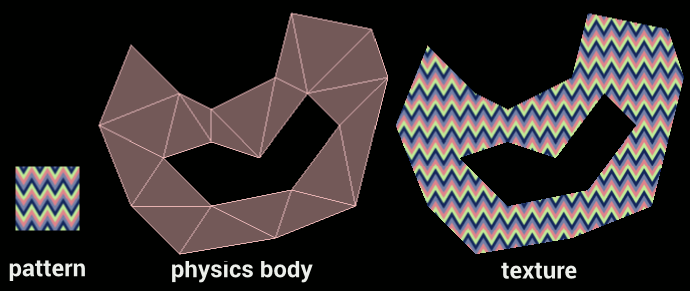

Texture polygon (texpoly)
=========================

Texpoly is a cocos2d-x project example part of a short turorial on texture and polygon triangulation with cocos2d-x and box2d. The tutorial is available at http://voodoocactus.com/devlog//2014/01/27/texture-polygon/. A video demo is also available [here](https://www.youtube.com/watch?v=yKfnhK9xknE).

## Requirements

* cocos2d-x 2.2.1

## Installation and usage
* Clone the git repository in $YOUR_COCOS2D_ROOT/projects
* Open either the proj.ios/texpoly.xcodeproj or proj.mac/texpoly.xcodeproj projects

## Credits
[cocos2d-x](http://www.cocos2d-x.org/)
[box2d](http://box2d.org/)
[poly2tri](https://code.google.com/p/poly2tri/)
[clipper](http://www.angusj.com/delphi/clipper.php)
